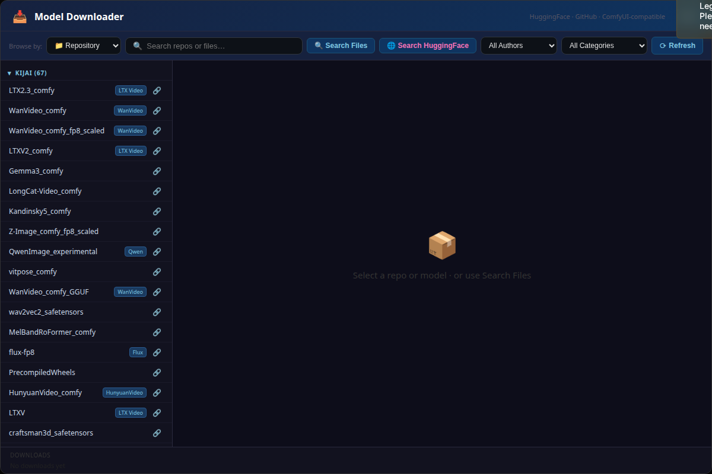
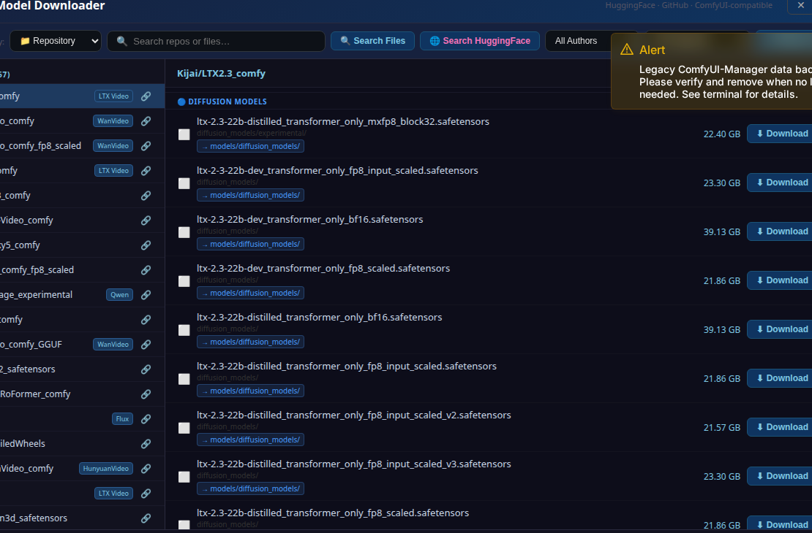
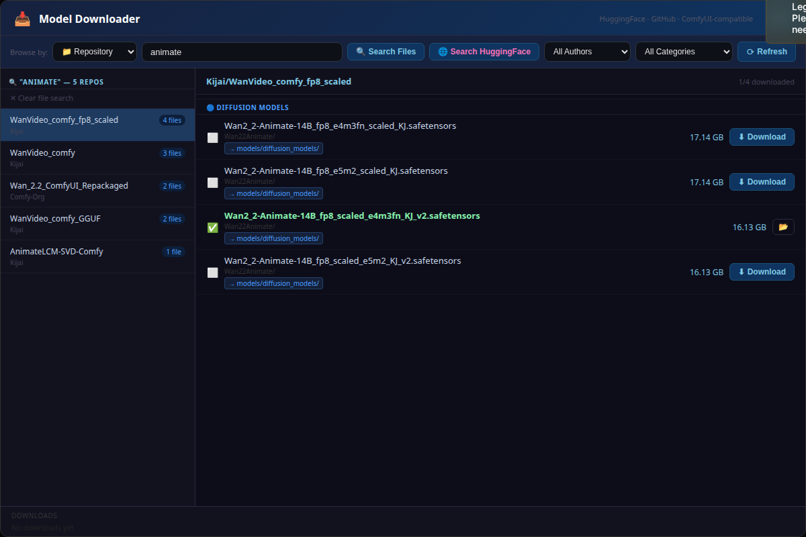
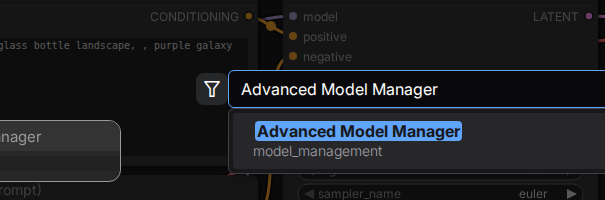
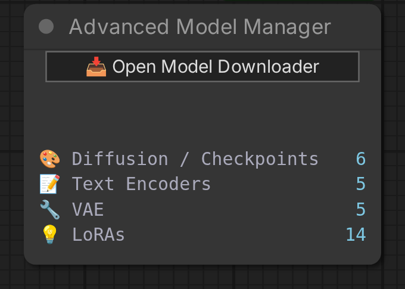

# 📦 Advanced Model Manager for ComfyUI

A powerful model browser, downloader and manager built directly into ComfyUI. Browse hundreds of HuggingFace repositories, search across every file in every repo instantly, download models straight to the right folder, manage GitHub workflows, and track everything you have installed — all without leaving ComfyUI.

---

## ✨ Features at a Glance

| Feature | Description |
|---|---|
| 🔗 **Paste a link** | Paste any HuggingFace, Civitai, GitHub or direct URL — the file type is recognised and it lands in the right folder |
| ➜ **Move files** | Landed in the wrong folder? Move it from the Downloaded tab, with a searchable folder picker |
| 🔍 **Instant cross-repo search** | Type any word and find matching files across ALL repos simultaneously |
| 📁 **Repository browser** | Repos grouped by author with model-family badges (WanVideo, Flux, LTX, etc.) |
| ⬇️ **One-click download** | Files go straight to the correct ComfyUI model subfolder automatically |
| 📋 **Workflow browser** | Browse and download ComfyOrg + Kijai example workflow JSONs from GitHub |
| 💾 **Downloaded tab** | See every model you have installed, delete files, open folders |
| 🌐 **HuggingFace live search** | Search HuggingFace directly to discover new repos not in the index |
| 📊 **Node widget** | Shows live model counts (Diffusion, Text Encoders, VAE, LoRAs) on the graph node |
| ⌨️ **Keyboard shortcut** | `Ctrl + Shift + M` to open/close the panel from anywhere |

---

## 🖼️ Screenshots

### Browse Repositories
All HuggingFace repos listed in the left panel, grouped by author and tagged by model family. Click any repo to load its files.



---

### View & Download Files
Select a repo to see all its files with sizes and download status. Files already on disk are marked. Click **Download** to save a file directly to the correct ComfyUI folder.



---

### Instant Search Across All Repos
Type any word in the search box — results appear instantly across **all** repos. Results are grouped by repo in the left panel. Matching files are shown on the right. Case-insensitive, multi-word, ignores underscores and dashes.



---

## 🚀 Installation

### Option 1 — ComfyUI Manager (Recommended)
1. Open **ComfyUI Manager** → **Install Custom Nodes**
2. Search for **Advanced Model Manager**
3. Click Install and restart ComfyUI

### Option 2 — Manual
```bash
cd ComfyUI/custom_nodes
git clone https://github.com/BISAM20/ComfyUI-advanced-model-manager
cd ComfyUI-advanced-model-manager
pip install -r requirements.txt
```
Restart ComfyUI.

---

## 🎮 How to Use

### Adding the node to your graph
Double-click on an empty area of the ComfyUI canvas to open the node search, type **Advanced Model Manager**, then click the result to place it.



Once placed, the node shows a live count of all your installed models and a button to open the manager panel:



### Browsing & Downloading Models
1. The left panel lists all HuggingFace repos by author
2. Click any repo name to load its files on the right
3. Each file shows its **size** and whether it is already **downloaded** (✓ checkmark)
4. Click **↓ Download** to save a file — it goes to the correct ComfyUI subfolder automatically (e.g. `models/diffusion_models/`, `models/loras/`, etc.)

### Downloading from a Link (🔗 Paste Link)

Found a model somewhere else? Click **🔗 Paste Link**, paste the URL, and press **Resolve** (or `Ctrl+Enter`). The file is identified, its size is looked up, and the correct ComfyUI folder is picked automatically — then click **Download**.

Recognised link types:

| You paste | What happens |
|---|---|
| `https://civitai.com/models/122359` | Latest version's files, folder from the Civitai model type (LORA → `loras/`, Checkpoint → `checkpoints/`, …) |
| `https://civitai.com/models/4384?modelVersionId=128713` | That specific version |
| `https://civitai.com/api/download/models/62833` | The version behind that download link |
| `https://huggingface.co/<repo>/blob/main/path/file.safetensors` | That single file, classified by path + repo README |
| `https://huggingface.co/<repo>/resolve/main/…` | Same — `?download=true` suffixes are fine |
| `https://huggingface.co/<repo>` | Opens the repo in the normal file browser |
| `Comfy-Org/flux1-dev` | Bare repo ids work too |
| `https://github.com/<owner>/<repo>/blob/<branch>/file.json` | Downloaded via `raw.githubusercontent.com` |
| Any direct `.safetensors` / `.gguf` / `.ckpt` / `.pt` / `.json` URL | Filename taken from the URL or `Content-Disposition` |

You can paste **several links at once**, one per line. Every row has a destination dropdown, so if the auto-detection guesses wrong you can correct it before downloading. Files already on disk are marked and skipped.

### Searching Across All Repos
Just type in the search box — no button needed. The tool searches every file in every repo:
- `animate` → finds all files with "animate" in the name across all repos
- `wan fp8` → finds Wan FP8 files even if the name uses underscores like `Wan_fp8`
- `ltx lora` → multi-word search, both words must be present

Search is **case-insensitive** and normalises underscores, dashes and dots to spaces.

### HuggingFace Live Search
Click **🌐 Search HuggingFace** to search the live HuggingFace index for repos not already in the local index. Results are clickable and load their file list exactly like local repos.

### Workflows Tab
Switch to **📋 Workflows** mode to browse and download workflow JSON files from:
- **ComfyOrg** official example workflows
- **Kijai** WanVideoWrapper example workflows

Workflows are saved directly to your `ComfyUI/user/default/workflows/` folder.

### Downloaded Tab (💾)
Switch to the **💾 Downloaded** tab to see all models currently on disk, organised by category. From here you can:
- Pick **➜ Move to…** to move a file into a different model folder
- Click 📂 to open the containing folder in your file manager
- Click 🗑️ to delete a file

### Moving a File to the Right Folder

Auto-classification occasionally guesses wrong — a LoRA can land in `diffusion_models/`, or a text encoder in `checkpoints/`. Rather than digging through the filesystem, open the **💾 Downloaded** tab, find the file, and click **➜ Move to…**. Confirm the destination and it's moved.

**Finding the destination.** The picker opens with a search box, so you can type instead of scrolling a long list:

- `vae` → `vae`, `vae_approx`
- `up mod` → `upscale_models`, `latent_upscale_models` — multi-word, order-independent
- `↑` `↓` to move, `Enter` to pick, `Esc` to close

Search also matches **old folder aliases**, so habits still work: typing `unet` finds `diffusion_models`, and `clip` finds `text_encoders`. Hover any entry to see the real directory it writes to.

**Which folders are offered.** Only directories inside your `ComfyUI/models/` folder, plus anything on a separate drive configured through `extra_model_paths.yaml`. Non-model locations — `custom_nodes/`, per-node asset directories, `configs/`, `user/default/workflows/` — are never offered. Folder types that ComfyUI aliases to the same directory (`diffusion_models` / `unet` / `unet_gguf`, or `clip` / `text_encoders`) collapse into one entry, so a destination never appears twice. Workflow `.json` files have no Move button, since there is nowhere sensible to send them.

**How the move behaves.**

- Moves within the same drive are **instant** and never duplicate the file.
- Moving onto a different drive (e.g. a path from `extra_model_paths.yaml`) is necessarily a copy, so progress is shown in the row. The original is only deleted once the copy has fully landed, and an interrupted or cancelled move leaves your source file untouched with no partial file at the destination.
- If a file of the same name already exists at the destination, the move is refused rather than overwriting it.
- Files kept in subfolders (`models/loras/flux/mylora.safetensors`) can be moved and deleted like any other.

### Category Filter
Use the **All Categories** dropdown to filter the repo list and search results to a specific type: Checkpoints, LoRAs, VAE, Text Encoders, Upscalers, etc.

### Refresh / Build Index
Click **Refresh** to rebuild the local file index. The index is what makes instant cross-repo search possible. Progress is shown live. Once built, search is instant even across hundreds of repos.

---

## 📊 Graph Node

Add the **Advanced Model Manager** node to your workflow graph to get a live dashboard showing how many models of each type you have installed. Click **Open Model Downloader** on the node to open the full panel.


Model counts update automatically every 8 seconds.

---

## 📂 Where Files Are Saved

The tool automatically classifies files and saves them to the right folder:

| File type | Saved to |
|---|---|
| `.safetensors`, `.ckpt` checkpoint files | `models/checkpoints/` or `models/diffusion_models/` |
| LoRA files | `models/loras/` |
| VAE files | `models/vae/` |
| Text encoder / CLIP files | `models/text_encoders/` or `models/clip/` |
| Upscaler files | `models/upscale_models/` |
| ControlNet files | `models/controlnet/` |
| Embeddings / textual inversions | `models/embeddings/` |
| Hypernetworks | `models/hypernetworks/` |
| Workflow `.json` files | `user/default/workflows/` |

Any path you have configured in `extra_model_paths.yaml` is respected. When downloading from a pasted link you can override the detected destination before confirming.

---

## ⚙️ Requirements

- ComfyUI (any recent version)
- Python 3.10+
- `huggingface_hub >= 0.20.0`
- `requests >= 2.28.0`

---

## 🔑 Tokens (Optional)

### HuggingFace

For downloading gated models (e.g. Meta Llama), set your HuggingFace token in your environment:

```bash
export HF_TOKEN=hf_your_token_here
```

Or log in via the CLI:
```bash
huggingface-cli login
```

### Civitai

Some Civitai models require an account to download. Create an API key in your Civitai account settings and set:

```bash
export CIVITAI_TOKEN=your_civitai_api_key
```

Tokens are only ever sent to the host they belong to — your HuggingFace token is never sent to Civitai, and vice versa.

---

## 📄 License

MIT License — see [LICENSE](LICENSE) for details.

---

## 🙏 Credits

Built for the ComfyUI community. Repos and models sourced from [HuggingFace](https://huggingface.co). Workflow JSONs from [ComfyOrg](https://github.com/comfyanonymous) and [Kijai](https://github.com/kijai).
